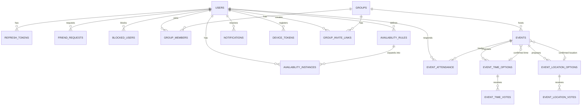

# You G? — Database Design

Status: **Signed off — 2026-07-13**
Last updated: 2026-07-13

## 1. Design Principles (why before what)

- **UTC everywhere.** Every timestamp column is stored in UTC; conversion to the user's timezone happens client-side (NFR-10). No `timestamp without time zone` columns — always `timestamptz`.
- **Primary keys: sequential UUIDs (UUIDv7), not bigint identity.** Trade-off worth spelling out:
  | Option | Trade-off |
  |---|---|
  | `bigint IDENTITY` | Smallest, fastest index, but sequential integers leak information (enumerable — `/users/1001`, `/users/1002` lets anyone scrape the user base) and are awkward for client-generated IDs (e.g. optimistic UI). |
  | Random UUIDv4 | Non-enumerable, but random insertion order causes B-tree index page splits/fragmentation at scale — a real performance cost once tables grow. |
  | **UUIDv7 (time-ordered UUID)** | Non-enumerable like v4, but the leading bits are timestamp-based, so inserts are still roughly sequential — keeps index locality while avoiding enumeration. .NET 9 / EF Core 9 support this natively (`Guid.CreateVersion7()`). |

  This is the right default for a public-facing API where resource IDs appear in URLs (invite links, `/groups/{id}`) — chosen deliberately over the simpler bigint default.
- **Normalization target: 3NF**, with deliberate, explained exceptions (noted inline below) rather than accidental denormalization.
- **Soft-delete for accounts, hard-delete for PII.** Account deletion (FR-11) doesn't hard-delete the `Users` row — it would orphan foreign keys from other users' data (e.g. an event history row referencing a deleted attendee). Instead: PII columns (email, password hash, display name, bio, profile picture, Google ID) are nulled/scrubbed and `IsDeleted`/`DeletedAt` set; the row remains as a tombstone so referential integrity and other users' event/vote history stay intact. This is a common, deliberate pattern (not a shortcut) — flagged for your sign-off in Section 7 since it's a real privacy/UX trade-off.
- **Every "many people relate to the same thing" pattern is a join table with its own surrogate key** (not a composite PK), so EF Core mapping stays simple and each relationship row can carry metadata (role, status, timestamps) cleanly.

## 2. Entity-Relationship Diagram

## 3. Table Definitions

### 3.1 `Users`
| Column | Type | Constraints |
|---|---|---|
| Id | uuid | PK |
| Email | citext | unique, nullable (null if Google-only account with no email collected... actually always required — see note) |
| PasswordHash | text | nullable (null for Google-only accounts) |
| GoogleId | text | unique, nullable |
| Username | citext | unique, not null |
| FriendCode | varchar(10) | unique, not null (e.g. `YG-7F3K2A`) |
| DisplayName | text | not null |
| Bio | text | nullable |
| ProfilePictureUrl | text | nullable |
| TimeZoneId | text | not null (IANA tz name, e.g. `Australia/Sydney`) |
| IsDeleted | boolean | not null, default false |
| DeletedAt | timestamptz | nullable |
| CreatedAt | timestamptz | not null |
| UpdatedAt | timestamptz | not null |

*Note: `Email` is required at signup even for Google Sign-In (Google provides it) — it's the account-recovery channel, so it's never truly optional, just the password may be null.*

### 3.2 `RefreshTokens`
| Column | Type | Constraints |
|---|---|---|
| Id | uuid | PK |
| UserId | uuid | FK → Users, not null |
| TokenHash | text | not null (never store raw token) |
| ExpiresAt | timestamptz | not null |
| RevokedAt | timestamptz | nullable |
| ReplacedByTokenId | uuid | FK → RefreshTokens, nullable (rotation chain) |
| CreatedAt | timestamptz | not null |

### 3.3 `FriendRequests`
Doubles as the friendship record — `Status = Accepted` *is* the friendship, avoiding a separate `Friendships` table that would need to stay in sync.

| Column | Type | Constraints |
|---|---|---|
| Id | uuid | PK |
| RequesterId | uuid | FK → Users, not null |
| AddresseeId | uuid | FK → Users, not null |
| Status | smallint (enum: Pending/Accepted/Declined) | not null |
| CreatedAt | timestamptz | not null |
| RespondedAt | timestamptz | nullable |

Constraint: unique on `(RequesterId, AddresseeId)` — prevents duplicate pending requests. Application-layer check prevents both `(A,B)` and `(B,A)` existing simultaneously (checked before insert, not DB-enforced, since a DB constraint can't easily express "unordered pair uniqueness" without a canonical-ordering trick that adds complexity for little benefit at this scale).

### 3.4 `BlockedUsers`
| Column | Type | Constraints |
|---|---|---|
| Id | uuid | PK |
| BlockerId | uuid | FK → Users, not null |
| BlockedId | uuid | FK → Users, not null |
| CreatedAt | timestamptz | not null |

Constraint: unique on `(BlockerId, BlockedId)`.

### 3.5 `Groups`
| Column | Type | Constraints |
|---|---|---|
| Id | uuid | PK |
| Name | text | not null |
| Description | text | nullable |
| PictureUrl | text | nullable |
| CreatedByUserId | uuid | FK → Users, not null |
| CreatedAt | timestamptz | not null |
| UpdatedAt | timestamptz | not null |

### 3.6 `GroupMembers`
| Column | Type | Constraints |
|---|---|---|
| Id | uuid | PK |
| GroupId | uuid | FK → Groups, not null |
| UserId | uuid | FK → Users, not null |
| Role | smallint (enum: Admin/Member) | not null |
| JoinedAt | timestamptz | not null |

Constraint: unique on `(GroupId, UserId)`. `Role` living here (not a separate `Roles` table) is a deliberate denormalization-that-isn't — it's a per-membership attribute, functionally dependent on the `(GroupId, UserId)` composite, so it's still 3NF, just correctly scoped to the join table rather than needing its own entity for two fixed values.

### 3.7 `GroupInviteLinks`
| Column | Type | Constraints |
|---|---|---|
| Id | uuid | PK |
| GroupId | uuid | FK → Groups, not null |
| Code | varchar(12) | unique, not null |
| CreatedByUserId | uuid | FK → Users, not null |
| ExpiresAt | timestamptz | not null (default: `CreatedAt + 7 days`, per Phase 1 decision) |
| RevokedAt | timestamptz | nullable (manual early revocation) |
| CreatedAt | timestamptz | not null |

### 3.8 `AvailabilityRules` (recurrence definitions — the source of truth a user edits)
| Column | Type | Constraints |
|---|---|---|
| Id | uuid | PK |
| UserId | uuid | FK → Users, not null |
| DayOfWeek | smallint | not null (0=Sunday..6=Saturday) |
| Daypart | smallint (enum: Morning/Afternoon/Evening/Night/WholeDay) | not null |
| Status | smallint (enum: Available/Busy/Maybe) | not null |
| EffectiveFrom | date | not null |
| EffectiveUntil | date | nullable (open-ended if null) |
| CreatedAt | timestamptz | not null |
| UpdatedAt | timestamptz | not null |

### 3.9 `AvailabilityInstances` (materialized — what overlap queries actually read)
| Column | Type | Constraints |
|---|---|---|
| Id | uuid | PK |
| UserId | uuid | FK → Users, not null |
| Date | date | not null |
| Daypart | smallint (enum, same as above) | not null |
| Status | smallint (enum: Available/Busy/Maybe/Unknown) | not null |
| SourceRuleId | uuid | FK → AvailabilityRules, nullable (null = one-off manual override) |
| UpdatedAt | timestamptz | not null |

Constraint: unique on `(UserId, Date, Daypart)` — one status per user per date per daypart slot. A one-off manual edit for a specific date simply upserts this table directly (with `SourceRuleId = null`), overriding what the recurrence sweep would have generated — the sweep job never overwrites a row where `SourceRuleId` doesn't match its own rule, so manual overrides persist. `WholeDay` entries are enforced (at the Application layer, not DB) to be exclusive with granular dayparts for the same user+date.

### 3.10 `Events`
| Column | Type | Constraints |
|---|---|---|
| Id | uuid | PK |
| GroupId | uuid | FK → Groups, not null |
| CreatedByUserId | uuid | FK → Users, not null |
| Title | text | not null |
| Description | text | nullable |
| MaxAttendees | int | nullable |
| Status | smallint (enum: Proposed/Confirmed/Cancelled) | not null |
| ConfirmedTimeOptionId | uuid | FK → EventTimeOptions, nullable |
| ConfirmedLocationOptionId | uuid | FK → EventLocationOptions, nullable |
| CreatedAt | timestamptz | not null |
| UpdatedAt | timestamptz | not null |

**Design note**: rather than a single fixed `StartTime`/`Location` on `Events` plus a *separate* voting mechanism, every event always goes through the options tables — even an organizer who sets a fixed time/place directly is really just creating a single pre-confirmed option. This keeps one code path for "propose → (optionally vote) → confirm" instead of two divergent models, and avoids duplicating time/location data between `Events` and the option tables.

### 3.11 `EventTimeOptions`
| Column | Type | Constraints |
|---|---|---|
| Id | uuid | PK |
| EventId | uuid | FK → Events, not null |
| StartUtc | timestamptz | not null |
| EndUtc | timestamptz | not null |
| ProposedByUserId | uuid | FK → Users, not null |
| CreatedAt | timestamptz | not null |

### 3.12 `EventLocationOptions`
| Column | Type | Constraints |
|---|---|---|
| Id | uuid | PK |
| EventId | uuid | FK → Events, not null |
| Name | text | not null |
| Address | text | nullable |
| Latitude | double precision | not null |
| Longitude | double precision | not null |
| ProposedByUserId | uuid | FK → Users, not null |
| CreatedAt | timestamptz | not null |

### 3.13 `EventTimeVotes` / `EventLocationVotes`
Same shape for both:
| Column | Type | Constraints |
|---|---|---|
| Id | uuid | PK |
| EventTimeOptionId / EventLocationOptionId | uuid | FK, not null |
| UserId | uuid | FK → Users, not null |
| CreatedAt | timestamptz | not null |

Constraint: unique on `(OptionId, UserId)` — one vote per user per option.

### 3.14 `EventAttendance`
| Column | Type | Constraints |
|---|---|---|
| Id | uuid | PK |
| EventId | uuid | FK → Events, not null |
| UserId | uuid | FK → Users, not null |
| Status | smallint (enum: Going/Maybe/CantGo) | not null |
| RespondedAt | timestamptz | not null |

Constraint: unique on `(EventId, UserId)`.

### 3.15 `Notifications`
| Column | Type | Constraints |
|---|---|---|
| Id | uuid | PK |
| UserId | uuid | FK → Users, not null (recipient) |
| Type | smallint (enum: FriendRequest/GroupInvite/EventReminder/ScheduleUpdate/...) | not null |
| Payload | jsonb | not null (polymorphic per-type data — e.g. `{ "groupId": "...", "eventId": "..." }`) |
| IsRead | boolean | not null, default false |
| CreatedAt | timestamptz | not null |

`Payload` is the one deliberate use of `jsonb` — notification data is inherently polymorphic per type, and modeling a separate strongly-typed table per notification type would be over-engineering for what's fundamentally a display-only feed.

### 3.16 `DeviceTokens`
| Column | Type | Constraints |
|---|---|---|
| Id | uuid | PK |
| UserId | uuid | FK → Users, not null |
| Token | text | unique, not null |
| Platform | smallint (enum: iOS/Android) | not null |
| LastUsedAt | timestamptz | not null |
| CreatedAt | timestamptz | not null |

## 4. Indexing Strategy

| Table | Index | Purpose |
|---|---|---|
| Users | unique (Email) | login lookup |
| Users | unique (Username) | search, uniqueness |
| Users | unique (FriendCode) | add-by-code lookup |
| RefreshTokens | (UserId) | list/revoke a user's tokens |
| RefreshTokens | unique (TokenHash) | refresh lookup |
| FriendRequests | unique (RequesterId, AddresseeId) | prevent duplicates |
| FriendRequests | (AddresseeId, Status) | "pending requests for me" feed |
| BlockedUsers | unique (BlockerId, BlockedId) | prevent duplicates |
| BlockedUsers | (BlockedId) | reverse block check on any interaction |
| GroupMembers | unique (GroupId, UserId) | membership check, prevent duplicates |
| GroupMembers | (UserId) | "my groups" query |
| GroupInviteLinks | unique (Code) | invite-link resolution |
| AvailabilityInstances | unique (UserId, Date, Daypart) | upsert target, prevents duplicates |
| AvailabilityInstances | (UserId, Date) | **critical path**: overlap computation scans this per group member over a date range |
| AvailabilityRules | (UserId) | list a user's rules for editing |
| Events | (GroupId, Status) | "upcoming events for this group" |
| EventTimeOptions / EventLocationOptions | (EventId) | load all options for an event |
| EventTimeVotes / EventLocationVotes | unique (OptionId, UserId) | prevent duplicate votes, fast tally |
| EventAttendance | unique (EventId, UserId) | prevent duplicates, fast tally |
| EventAttendance | (UserId) | "my upcoming events" |
| Notifications | (UserId, IsRead, CreatedAt DESC) | notification feed query — this is the one composite index worth calling out explicitly, since it's the highest-frequency read path in the app (checked on every app open) |
| DeviceTokens | (UserId) | push-send fan-out |

The `AvailabilityInstances (UserId, Date)` index is the one to watch under load: the Smart Time Finder's overlap query fans out across every group member for a date range, so this index is what keeps NFR-1 (<300ms p95 for a 15-member group over 7 days) achievable — it's a straightforward per-user range scan rather than a full table scan, and Postgres can combine it with the composite `(UserId, Date, Daypart)` unique index as a covering index for this read pattern.

## 5. Confirmed Decisions (2026-07-13)

1. **Account deletion**: soft-delete tombstone, confirmed. `Users.IsDeleted=true`, PII columns nulled, row persists so every referencing table (votes, attendance, group memberships) keeps working without per-table special-casing.
2. **Friendship model**: `FriendRequests` doubles as `Friendships`, confirmed. No separate table, no sync step — `Status = Accepted` is the friendship.

---
**Phase 3 signed off.** Proceeding to Phase 4 (REST API Design), which maps directly onto these tables.
